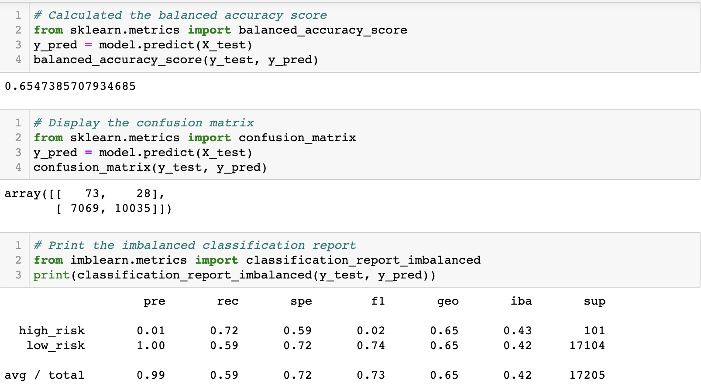
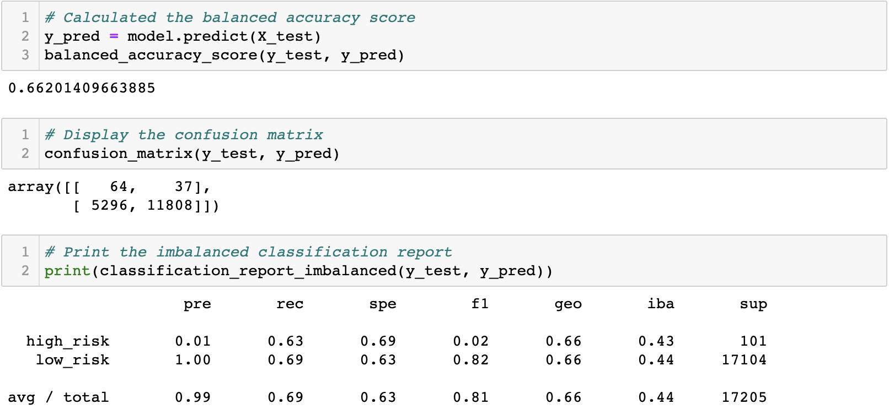
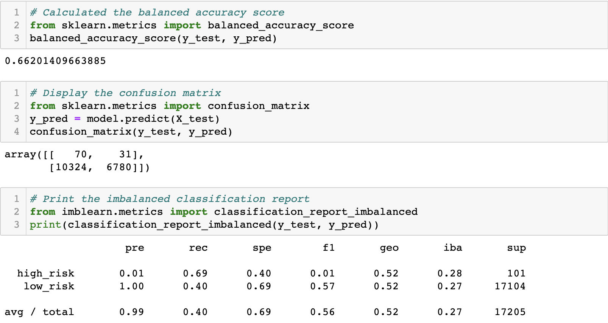
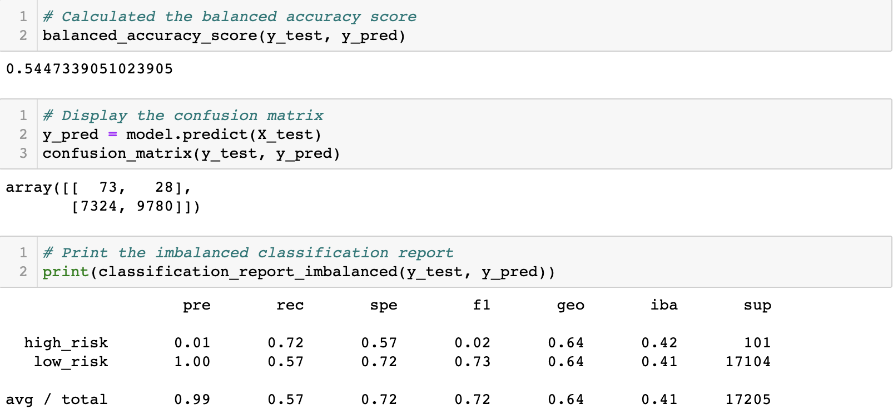
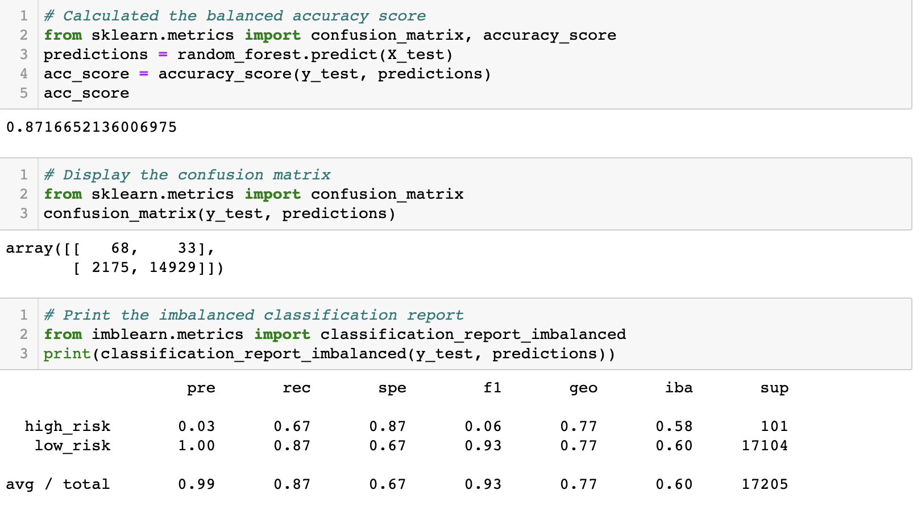
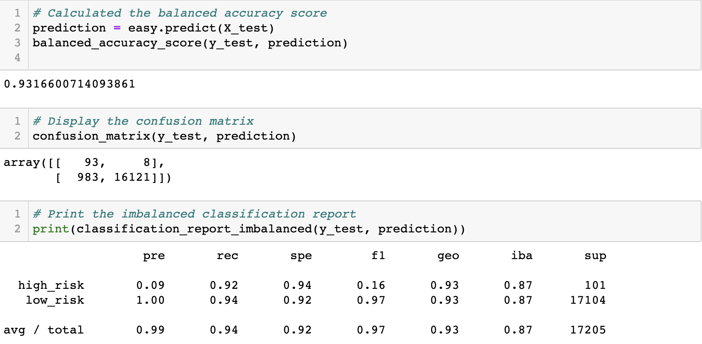

# Credit_Risk_Analysis

## Overview of the analysis
This project uses Python and different metrics of six machine-learning models for banks to predict credit risk.

## Results
### Random Oversampling model

The balanced accuracy score is about 65.47%.

The high risk precision is 1%. 

The high risk recall scores is 72%. 

### SMOTE Oversampling model

The balanced accuracy score is about 66.2%.

The high risk precision is 1%. 

The high risk recall scores is 63%. 

### Cluster Centroids model

The balanced accuracy score is about 66.2%.

The high risk precision is 1%. 

The high risk recall scores is 69%. 

### SMOTEENN model

The balanced accuracy score is about 54.47%.

The high risk precision is 1%. 

The high risk recall scores is 72%. 

### Balanced Random Forest Classifier 

The balanced accuracy score is about 87.17%.

The high risk precision is 3%. 

The high risk recall scores is 67%. 

### Easy Ensemble AdaBoost Classifier

The balanced accuracy score is about 93.17%.

The high risk precision is 9%. 

The high risk recall scores is 92%. 

## Summary
All modules are used to predict the credit risk. 
The SMOTE Oversampling model did not get better results after resample. Although resampling can attempt to address imbalance, it does not guarantee better results.
Easy Ensemble AdaBoost Classifier has the highest accuracy of 93.17%, so I recommend this model because it has the highest accuracy score and reduces the most credit risk. 

